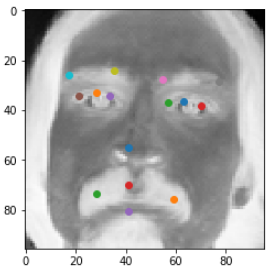

# Facial Keypoints Detection 발표

## 1. 데이터 전처리

```python
import pandas as pd
import numpy as np
from PIL import Image

def makingResultsList(trainingData) :
    resultsList = []
    for i in range(len(trainingData.iloc[:, 0])) :
        resultsList.append(np.array(trainingData.iloc[i][:30]))
    return resultsList

def makingClassesList(trainingData) :
    classesList = []
    for i in range(len(trainingData.iloc[:, 0])) :
        classesList.append(np.array(trainingData.columns[:-1]))
    return classesList

def makingImagesList(trainingData) :
    imagesList = []
    for i in range(len(trainingData.iloc[:, 0])) :
        imagesList.append(np.array(trainingData.iloc[i][30].split(" "), dtype=np.uint8))
    return imagesList

def resize96(trainingData):  # 전체 행의 image column을 96x96 행렬로 변환하여 resize_images에 입력
    imagesList = []
    for i in range(len(trainingData.iloc[:, 0])):  # len(a.iloc([:, 0]) 은 행의 갯수를 추출하기 위해 만듬
        imagesList.append(np.array(trainingData.iloc[i][30].split(" "), dtype=np.uint8).reshape(96, 96))
        # dtype를 uint8로 지정해줘야 그림이 출력됨
    return imagesList

def showImage(imagesList, row):
    # 원하는 행의 사진을 출력합니다.
    # imagesList.append(np.array(trainingData.iloc[i][30].split(" "), dtype=np.uint8).reshape(96, 96)) 에서
    # dtype를 uint8로 지정해줘야 그림이 출력됨
    return Image.fromarray(imagesList[row])


def makingBatch(imagesList, resultsList, count, batch_size) :
    batch_xs = np.array(imagesList[count*batch_size:(count+1)*batch_size])
    batch_ys = np.array(resultsList[count*batch_size:(count+1)*batch_size])
    return batch_xs, batch_ys


if __name__ == "__main__":
    trainingData = pd.read_csv("training.csv")
    trainingData.dropna(inplace=True)
    # trainingData.info()

    imagesList = []
    imagesList = makingImagesList(trainingData)
    resultsList = []
    resultsList = makingResultsList(trainingData)
```


## 2. Convolution Layer 설정

### (1) Convolution Layer 1

```python
'''
Convolution Layer1
'''
# hyper parameters
learning_rate = 0.001
training_epochs = 100
batch_size = 20

# input place holders
# 96 * 96 = 9216
X = tf.placeholder(tf.float32, [None, 9216]) 

# [many images, 96x96, black&white]
X_img = tf.reshape(X, [-1, 96, 96, 1])

# eyes XY, noseXY, .. colums' counts are 30
Y = tf.placeholder(tf.float32, [None, 30])

# declare first Convolution Frame. [3x3, black/white, 32 nodes(conventions)]
W1 = tf.Variable(tf.random_normal([3, 3, 1, 32], stddev=0.01))
print('W1 (tf.random_normal) \t: ', W1)

# declare first Convolution. per moving 1pixel to right&down
# Conv -> (?, 96, 96, 32)
L1 = tf.nn.conv2d(X_img, W1, strides=[1, 1, 1, 1], padding='SAME')
print('tf.nn.conv2d \t: ', L1)

# First Relu
L1 = tf.nn.relu(L1)
print('tf.nn.relu \t: ', L1)

# First Pool
# Pool -> (?, 48, 48, 32)
L1 = tf.nn.max_pool(L1, ksize=[1, 2, 2, 1],strides=[1, 2, 2, 1], padding='SAME')
print('tf.nn.max_pool \t: ', L1)
```


### (2) Convolution Layer 2

```Python
'''
Convolution Layer2
'''
# tf.nn.max_pool 	:  Tensor("MaxPool_1:0", shape=(?, 48, 48, 32), dtype=float32)
# declare second Convolution Frame. [3x3, 32 black/white base nodes, 64 nodes(conventions)]
# increase 32nodes to 64nodes
W2 = tf.Variable(tf.random_normal([3, 3, 32, 64], stddev=0.01)) 
print('W2 (tf.random_normal) \t: ', W2)

# declare second Convolution. per moving 1pixel to right&down
#    Conv      ->(?, 48, 48, 64)
L2 = tf.nn.conv2d(L1, W2, strides=[1, 1, 1, 1], padding='SAME')
print('tf.nn.conv2d \t:', L2)

# Second Relu
L2 = tf.nn.relu(L2)
print('tf.nn.relu \t:', L2)

# Second Pool
#    Pool      ->(?, 24, 24, 64)
L2 = tf.nn.max_pool(L2, ksize=[1, 2, 2, 1], strides=[1, 2, 2, 1], padding='SAME')
print('tf.nn.max_pool \t:', L2)


'''
Making 4demension to 2demension
'''
L2_flat = tf.reshape(L2, [-1, 24 * 24 * 64])
print('tf.reshape \t:', L2_flat)
```


### (3) Fully Connected Layer + Model Saver

```python
'''
Fully Connected (FC, Dense) Layer
'''

# ★모델 저장용★학습에 직접적으로 사용하지 않고 학습 횟수에 따라 단순히 증가시킬 변수를 만듭니다.
global_step = tf.Variable(0, trainable=False, name='global_step')


# Final FC 24x24x64 inputs -> 10 outputs
#reuse=tf.AUTO_REUSE
W6 = tf.get_variable("W6", shape=[24 * 24 * 64, 30], initializer=tf.contrib.layers.xavier_initializer())
print('W6 (xavier_initializer) \t: ', W6)

b = tf.Variable(tf.random_normal([30])) ## 임의의 수 10개를 만든다. ([1], 0, 10) 으로 하면 0에서 10사이에서 임의의 수 1개를 만든다.

# logits = AX1 + BX2 + CX3 + ... + ?X30 + b
logits = tf.matmul(L2_flat, W6) + b

```


```python
# define cost/loss & optimizer
# cost = tf.reduce_mean(tf.nn.softmax_cross_entropy_with_logits(logits=logits, labels=Y))
cost = tf.reduce_mean(tf.square(logits-Y))
# optimizer = tf.train.AdamOptimizer(learning_rate=learning_rate).minimize(cost)

# ★모델 저장용★
optimizer = tf.train.AdamOptimizer(learning_rate=learning_rate)
# ★모델 저장용★ global_step로 넘겨준 변수를, 학습용 변수들을 최적화 할 때 마다 학습 횟수를 하나씩 증가시킵니다.
train_op = optimizer.minimize(cost, global_step=global_step)

print('cost :', cost)
print('optimizer :\n', optimizer)
print('train_op :\n', train_op)
```


## 3. Training

### (1) resultsList 데이터 전처리

```Python
def makingResultsList(trainingData) :
    resultsList = []
    for i in range(len(trainingData.iloc[:, 0])) :
        resultsList.append(np.array(trainingData.iloc[i][:30]))
    return resultsList

if __name__ == "__main__":
    trainingData = pd.read_csv("training.csv")
    trainingData.dropna(inplace=True)
    resultsList = []
    resultsList = makingResultsList(trainingData)
```


### (2) Training 실행

#### IN

```Python
'''
Training
'''
# initialize
sess = tf.Session() ## 세션 생성

# ★모델 저장용★
# 모델을 저장하고 불러오는 API를 초기화합니다.
# global_variables() 함수를 통해 앞서 정의하였던 변수들을 저장하거나 불러올 변수들로 설정합니다.
saver = tf.train.Saver(tf.global_variables())
chkpoint = tf.train.get_checkpoint_state('./models')
if chkpoint and tf.train.checkpoint_exists(chkpoint.model_checkpoint_path):
    saver.restore(sess, chkpoint.model_checkpoint_path)
else:
    sess.run(tf.global_variables_initializer()) # 세션 내 변수를 초기화


# train my model
print('Learning started. It takes sometime.')
time1 = time.time()
for epoch in range(training_epochs): ## training_epochs는 위에서 15로 정의했다.
    avg_cost = 0
    total_batch = int(len(trainingData.iloc[:,0]) / batch_size) 
    ## batch_size는 샘플을 한 번에 몇 개씩 처리할지를 정하는 부분. 너무 크면 학습 속도가 느려지고, 너무 작으면 각 실행 값의 편차가 생겨서 결과값이 불안정해진다.

    for i in range(total_batch):
        #### batch_xs, batch_ys = mnist.train.next_batch(batch_size)
        batch_xs, batch_ys = makingBatch(imagesList, resultsList, i, batch_size)
        feed_dict = {X: batch_xs, Y: batch_ys}
        # ★모델 저장용★ optimizer를 train_op로 변경해준다.
        # c, _ = sess.run([cost, optimizer], feed_dict=feed_dict)
        c, _ = sess.run([cost, train_op], feed_dict=feed_dict)
        avg_cost += c / total_batch    

    print('Epoch:', '%04d' % (epoch + 1), 'cost =', '{:.9f}'.format(avg_cost))
    print('Step: %d, ' % sess.run(global_step))
    if (float(avg_cost) <= 7) :
        break    

print('Learning Finished!')
time2 = time.time()

chk_processting_time(time1, time2)


# ★모델 저장용★최적화가 끝난 뒤, 변수를 저장합니다.
saver.save(sess, './models/test.model', global_step=global_step)
```


#### OUT 1

```python
Learning started. It takes sometime.
Epoch: 0001 cost = 232.863799478
Step: 107, 
Epoch: 0002 cost = 132.333481013
Step: 214, 
Epoch: 0003 cost = 109.614636109
Step: 321, 
Epoch: 0004 cost = 97.746303006
Step: 428, 
Epoch: 0005 cost = 92.402428208
Step: 535, 
Epoch: 0006 cost = 85.443577294
Step: 642, 
Epoch: 0007 cost = 74.732012241
Step: 749, 
Epoch: 0008 cost = 66.962680826
Step: 856, 
Epoch: 0009 cost = 60.856282956
Step: 963, 
Epoch: 0010 cost = 55.379748255
Step: 1070, 
Epoch: 0011 cost = 52.692185571
Step: 1177, 
Epoch: 0012 cost = 52.769131259
Step: 1284, 
Epoch: 0013 cost = 52.894127026
Step: 1391, 
Epoch: 0014 cost = 51.873226594
Step: 1498, 
Epoch: 0015 cost = 60.664808362
Step: 1605, 
Epoch: 0016 cost = 69.916626930
Step: 1712, 
Epoch: 0017 cost = 65.907860979
Step: 1819, 
Epoch: 0018 cost = 51.925600123
Step: 1926, 
Epoch: 0019 cost = 52.895996120
Step: 2033, 
Epoch: 0020 cost = 41.761264739
Step: 2140, 
Epoch: 0021 cost = 52.018105133
Step: 2247, 
Epoch: 0022 cost = 59.567233585
Step: 2354, 
Epoch: 0023 cost = 58.587146634
Step: 2461, 
Epoch: 0024 cost = 62.880762127
Step: 2568, 
Epoch: 0025 cost = 51.306476691
Step: 2675, 
Epoch: 0026 cost = 45.128197349
Step: 2782, 
Epoch: 0027 cost = 34.975171330
Step: 2889, 
Epoch: 0028 cost = 35.663236355
Step: 2996, 
Epoch: 0029 cost = 38.139073737
Step: 3103, 
Epoch: 0030 cost = 35.858778633
Step: 3210, 
Epoch: 0031 cost = 30.701140921
Step: 3317, 
Epoch: 0032 cost = 37.333907301
Step: 3424, 
Epoch: 0033 cost = 42.925107965
Step: 3531, 
Epoch: 0034 cost = 41.422592435
Step: 3638, 
Epoch: 0035 cost = 35.976637729
Step: 3745, 
Epoch: 0036 cost = 38.675653569
Step: 3852, 
Epoch: 0037 cost = 30.843087954
Step: 3959, 
Epoch: 0038 cost = 28.999458264
Step: 4066, 
Epoch: 0039 cost = 35.298495618
Step: 4173, 
Epoch: 0040 cost = 37.808771303
Step: 4280, 
Epoch: 0041 cost = 46.265852202
Step: 4387, 
Epoch: 0042 cost = 39.143074695
Step: 4494, 
Epoch: 0043 cost = 41.225120625
Step: 4601, 
Epoch: 0044 cost = 40.851461758
Step: 4708, 
Epoch: 0045 cost = 35.414496293
Step: 4815, 
Epoch: 0046 cost = 28.616362977
Step: 4922, 
Epoch: 0047 cost = 20.760644467
Step: 5029, 
Epoch: 0048 cost = 16.140025743
Step: 5136, 
Epoch: 0049 cost = 15.320069589
Step: 5243, 
Epoch: 0050 cost = 15.511155982
Step: 5350, 
Epoch: 0051 cost = 15.337842181
Step: 5457, 
Epoch: 0052 cost = 14.945208313
Step: 5564, 
Epoch: 0053 cost = 13.210158800
Step: 5671, 
Epoch: 0054 cost = 13.254638419
Step: 5778, 
Epoch: 0055 cost = 14.213158570
Step: 5885, 
Epoch: 0056 cost = 12.843139212
Step: 5992, 
Epoch: 0057 cost = 12.597640951
Step: 6099, 
Epoch: 0058 cost = 12.508467180
Step: 6206, 
Epoch: 0059 cost = 12.424142472
Step: 6313, 
Epoch: 0060 cost = 13.851313076
Step: 6420, 
Epoch: 0061 cost = 17.012281298
Step: 6527, 
Epoch: 0062 cost = 17.492542739
Step: 6634, 
Epoch: 0063 cost = 18.357327025
Step: 6741, 
Epoch: 0064 cost = 22.483695300
Step: 6848, 
Epoch: 0065 cost = 22.967018083
Step: 6955, 
Epoch: 0066 cost = 20.246244072
Step: 7062, 
Epoch: 0067 cost = 19.175132263
Step: 7169, 
Epoch: 0068 cost = 22.738543203
Step: 7276, 
Epoch: 0069 cost = 26.760277298
Step: 7383, 
Epoch: 0070 cost = 24.861588197
Step: 7490, 
Epoch: 0071 cost = 22.788758715
Step: 7597, 
Epoch: 0072 cost = 26.721733142
Step: 7704, 
Epoch: 0073 cost = 22.358379729
Step: 7811, 
Epoch: 0074 cost = 23.010239414
Step: 7918, 
Epoch: 0075 cost = 23.339965366
Step: 8025, 
Epoch: 0076 cost = 20.275973503
Step: 8132, 
Epoch: 0077 cost = 23.033131363
Step: 8239, 
Epoch: 0078 cost = 28.241594194
Step: 8346, 
Epoch: 0079 cost = 15.500816118
Step: 8453, 
Epoch: 0080 cost = 16.404592109
Step: 8560, 
Epoch: 0081 cost = 16.169316011
Step: 8667, 
Epoch: 0082 cost = 15.930483029
Step: 8774, 
Epoch: 0083 cost = 16.496639281
Step: 8881, 
Epoch: 0084 cost = 20.146448938
Step: 8988, 
Epoch: 0085 cost = 17.356427161
Step: 9095, 
Epoch: 0086 cost = 14.995149938
Step: 9202, 
Epoch: 0087 cost = 15.072739846
Step: 9309, 
Epoch: 0088 cost = 15.996055024
Step: 9416, 
Epoch: 0089 cost = 20.601386908
Step: 9523, 
Epoch: 0090 cost = 21.096468070
Step: 9630, 
Epoch: 0091 cost = 26.890379830
Step: 9737, 
Epoch: 0092 cost = 25.596951806
Step: 9844, 
Epoch: 0093 cost = 23.618442999
Step: 9951, 
Epoch: 0094 cost = 23.840173601
Step: 10058, 
Epoch: 0095 cost = 20.190180306
Step: 10165, 
Epoch: 0096 cost = 25.959754886
Step: 10272, 
Epoch: 0097 cost = 31.273064030
Step: 10379, 
Epoch: 0098 cost = 36.542985435
Step: 10486, 
Epoch: 0099 cost = 30.243006412
Step: 10593, 
Epoch: 0100 cost = 28.881444931
Step: 10700, 
Learning Finished!
처리시간 : 67분 46초 경과되었습니다.
```


#### OUT 2

```python
INFO:tensorflow:Restoring parameters from ./models\test.model-20758
Learning started. It takes sometime.
Epoch: 0001 cost = 6.078383490
Step: 20865, 
Epoch: 0002 cost = 6.072668540
Step: 20972, 
Epoch: 0003 cost = 6.830112553
Step: 21079, 
Epoch: 0004 cost = 7.449869916
Step: 21186, 
Epoch: 0005 cost = 8.352173727
Step: 21293, 
Epoch: 0006 cost = 10.696961213
Step: 21400, 
Epoch: 0007 cost = 12.279057275
Step: 21507, 
Epoch: 0008 cost = 13.779989969
Step: 21614, 
Epoch: 0009 cost = 11.292702297
Step: 21721, 
Epoch: 0010 cost = 10.725824724
Step: 21828, 
Epoch: 0011 cost = 9.211302050
Step: 21935, 
Epoch: 0012 cost = 10.924486725
Step: 22042, 
Epoch: 0013 cost = 10.769073370
Step: 22149, 
Epoch: 0014 cost = 11.428662293
Step: 22256, 
Epoch: 0015 cost = 10.547963633
Step: 22363, 
Epoch: 0016 cost = 10.145477547
Step: 22470, 
Epoch: 0017 cost = 10.341958563
Step: 22577, 
Epoch: 0018 cost = 11.983439591
Step: 22684, 
Epoch: 0019 cost = 12.594369313
Step: 22791, 
Epoch: 0020 cost = 10.713956095
Step: 22898, 
Epoch: 0021 cost = 9.040282002
Step: 23005, 
Epoch: 0022 cost = 10.235192515
Step: 23112, 
Epoch: 0023 cost = 8.572116851
Step: 23219, 
Epoch: 0024 cost = 6.115574316
Step: 23326, 
Epoch: 0025 cost = 5.445399019
Step: 23433, 
Epoch: 0026 cost = 5.772294903
Step: 23540, 
Epoch: 0027 cost = 6.233295256
Step: 23647, 
Epoch: 0028 cost = 5.385516381
Step: 23754, 
Epoch: 0029 cost = 5.602124037
Step: 23861, 
Epoch: 0030 cost = 6.499343311
Step: 23968, 
Epoch: 0031 cost = 6.860573578
Step: 24075, 
Epoch: 0032 cost = 6.414000226
Step: 24182, 
Epoch: 0033 cost = 6.377137113
Step: 24289, 
Epoch: 0034 cost = 6.742012662
Step: 24396, 
Epoch: 0035 cost = 6.428499280
Step: 24503, 
Epoch: 0036 cost = 6.728137646
Step: 24610, 
Epoch: 0037 cost = 6.556732952
Step: 24717, 
Epoch: 0038 cost = 6.563983392
Step: 24824, 
Epoch: 0039 cost = 6.681499046
Step: 24931, 
Epoch: 0040 cost = 7.891079622
Step: 25038, 
Epoch: 0041 cost = 9.587823121
Step: 25145, 
Epoch: 0042 cost = 8.165881369
Step: 25252, 
Epoch: 0043 cost = 9.033962328
Step: 25359, 
Epoch: 0044 cost = 9.214110662
Step: 25466, 
Epoch: 0045 cost = 10.117191087
Step: 25573, 
Epoch: 0046 cost = 9.772617260
Step: 25680, 
Epoch: 0047 cost = 11.102719524
Step: 25787, 
Epoch: 0048 cost = 10.064770875
Step: 25894, 
Epoch: 0049 cost = 11.163109931
Step: 26001, 
Epoch: 0050 cost = 10.828203968
Step: 26108, 
Epoch: 0051 cost = 13.259304635
Step: 26215, 
Epoch: 0052 cost = 12.663964688
Step: 26322, 
Epoch: 0053 cost = 14.758507697
Step: 26429, 
Epoch: 0054 cost = 17.440768558
Step: 26536, 
Epoch: 0055 cost = 19.493742613
Step: 26643, 
Epoch: 0056 cost = 13.326404725
Step: 26750, 
Epoch: 0057 cost = 10.129573809
Step: 26857, 
Epoch: 0058 cost = 7.993386652
Step: 26964, 
Epoch: 0059 cost = 7.049151975
Step: 27071, 
Epoch: 0060 cost = 6.312125251
Step: 27178, 
Epoch: 0061 cost = 6.793083525
Step: 27285, 
Epoch: 0062 cost = 7.101351508
Step: 27392, 
Epoch: 0063 cost = 6.189231438
Step: 27499, 
Epoch: 0064 cost = 6.858108112
Step: 27606, 
Epoch: 0065 cost = 7.353350720
Step: 27713, 
Epoch: 0066 cost = 7.883372993
Step: 27820, 
Epoch: 0067 cost = 6.554556617
Step: 27927, 
Epoch: 0068 cost = 5.304780920
Step: 28034, 
Epoch: 0069 cost = 4.867975730
Step: 28141, 
Learning Finished!
처리시간 : 47분 48초 경과되었습니다.
```


### 4. Result

### (1) COST = 6.617302818

#### 1) training data



#### 2) test data


### (1) COST = 4.867975730

#### 1) test data

- Kaggle Score : 10.63107

