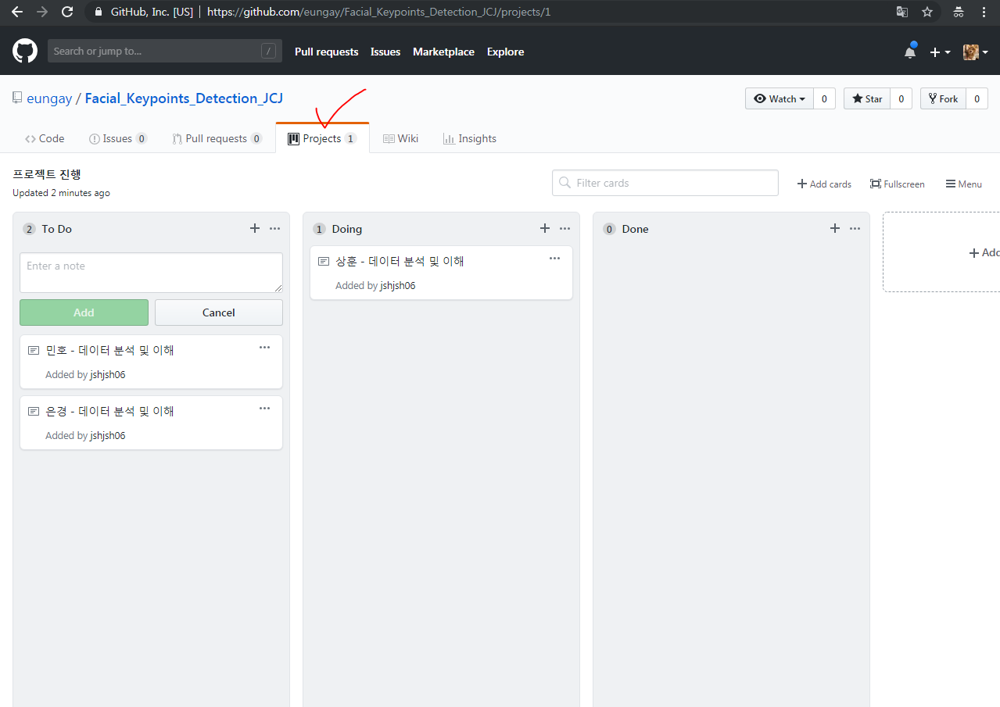

# 딥러닝 기반 빅데이터 분석 프로젝트

# C팀(JCJ팀) - Facial Keypoints Detection

## JCJ팀의 프로젝트는 Kaggle Facial Keypoints Detection입니다.(https://www.kaggle.com/c/facial-keypoints-detection)

- **각자 담당하고 있는 파일은 personal 폴더에 담아주세요.**
- **데이터 관련된 자료들은 Data_Only 폴더에 담아주세요**
  - Kaggle에서 제공하는 csv파일은 용량이 커서 업로드가 되지 않습니다. 유념해주세요!
- **프로젝트 진행상황은 프로젝트에서 공유해주세요!**
  - 

